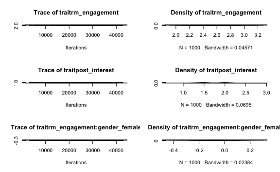
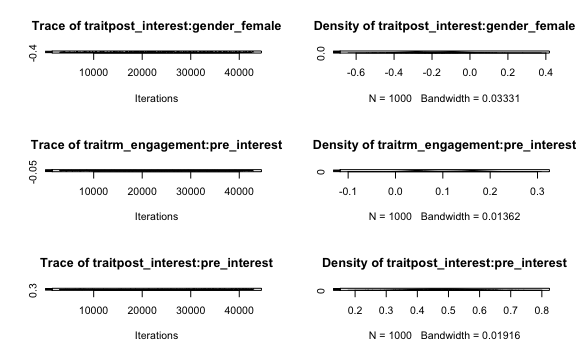
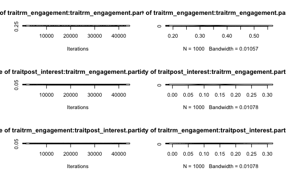
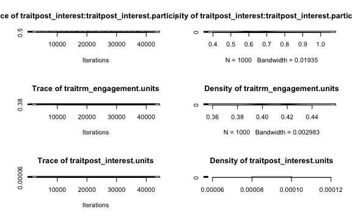
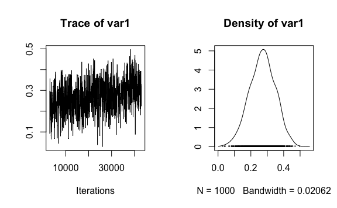

Using A Multivariate Model to Understand How Youths’ In-The-Moment Engagement Predicts Changes in Youths’ Interest
================
Joshua M. Rosenberg, Patrick N. Beymer, Thomas M. Houslay, and Jennifer A. Schmidt
3/27/2018

Table of Contents
=================

This document is structured around:

1.  Background (from AERA submission)
2.  Analysis

-   Using **lme4**
-   Using **MCMCglmm** (the focus of this work)

1. Background
=============

First, here's some background on the analysis (we also have a much longer version that we can pull from when we write this up; saved in `manuscript/draft-of-paper.Rmd`. This is also in the README.

Purpose and Theoretical Framework
---------------------------------

A strength of intensive data collection methods like the Experience Sampling Method (ESM; Hektner, Schmidt, & Csikszentmihalyi, 2007) is that they enable researchers to examine participants’ immediate experience and model changes in these experiences over time while accounting for multiple dependencies in the data. A current analytic challenge for researchers using this type of data involves examining how participants’ responses repeatedly measured throughout data collection cumulatively relate to some single, longer-term outcome.

Recently, out-of-school-time programs focusing on STEM have proliferated to combat declines in STEM interest during adolescence (National Academy of Engineering and National Research Council, 2014). Though many have argued that contexts for learning outside of school have an important role to play in youths’ development of interest (Hidi, Renninger, & Krapp, 2016), relatively little is known about whether and how youths’ interest develops in such contexts. Contemporary motivational theory suggests that interests emerge from the interactions of an individual in a particular environment, rather than residing entirely within the individual (Hidi et al., 2016). Thus it is essential to understand the ways that individuals engage with STEM-focused environments to know how STEM-related interests may emerge.

Method & Data Analysis
----------------------

The purpose of this study was to explore the utility of a particular analytic method for testing the effects of sustained engagement in summer STEM programs on the development of youth’s interest over time. The participants for the study were 203 racially and ethnically diverse youth in the Northeast United States. To determine how youths’ in-the-moment engagement related to their individual interest in STEM, a multivariate model estimated with tools familiar to Bayesian methods (namely, Markov Chain Monte Carlo \[MCMC\]). The model was estimated using the MCMCglmm R package (Hadfield, 2010) and includes both youths’ in-the-moment engagement (measured via ESM) and their post-program interest in a single, multivariate model. This approach contrasts with a multilevel modeling approach, for which two separate models are specified, which can contribute to overconfident inferences about effects (Houslay & Wilson, 2017). Also, a feature of MCMC is that its use allows for the recognition of complex data structures, which can be challenging to do when using a latent variable modeling approach.

Results & Significance
----------------------

The analysis showed that youths’ in-the-moment engagement was a significant, positive predictor (effect size r = .27) of youths’ post-program interest in STEM, accounting for their initial interest in STEM, their gender, and the nesting and cross-classification of youths’ responses. This effect is more conservative than that found as part of analyses carried out with separate models (r = .34; Rosenberg, Beymer, & Schmidt, 2018). Future work can use an extension of the methodological approach to examine both the (between-youth) effects of engagement upon post-program interest and (within-youth) relations between engagement and its rate of change and the effects of both upon interest development. This study demonstrates how embracing MCMC and Bayesian methods may be a natural fit for analyses when a goal is to embrace and study multivariate motivational processes in real-world settings that lead to novel insights into learning and development.

2. Analysis
===========

This section includes the results of an analysis . . .

-   predicting *post program-interest in STEM*
-   on the basis of *a repeated engagement measure (collected via ESM)*, - *pre-program interest in STEM*,
-   and a demographic variable (*gender*).

The first section uses **lme4**. The second uses **MCMCglmm**.

Loading data, setting up
------------------------

``` r
library(tidyverse)
## ── Attaching packages ────────────────────────────────────────────────────────────────── tidyverse 1.2.1 ──
## ✔ ggplot2 3.1.0       ✔ purrr   0.3.1  
## ✔ tibble  2.0.1       ✔ dplyr   0.8.0.1
## ✔ tidyr   0.8.2       ✔ stringr 1.4.0  
## ✔ readr   1.3.1       ✔ forcats 0.3.0
## ── Conflicts ───────────────────────────────────────────────────────────────────── tidyverse_conflicts() ──
## ✖ dplyr::filter() masks stats::filter()
## ✖ dplyr::lag()    masks stats::lag()
library(MCMCglmm)
## Loading required package: Matrix
## 
## Attaching package: 'Matrix'
## The following object is masked from 'package:tidyr':
## 
##     expand
## Loading required package: coda
## Loading required package: ape
library(lme4)
# install.packages("r2glmm")
library(r2glmm) # this is used, for now
# install.packages("konfound") # not used now
# library(konfound)
# install.packages("here")
library(here)
## here() starts at /Users/joshuarosenberg/Documents/modeling-changes-in-interest

d_red <- read_csv("processed-data/data-to-model.csv")
## Parsed with column specification:
## cols(
##   participant_ID = col_double(),
##   program_ID = col_double(),
##   rm_engagement = col_double(),
##   pre_interest = col_double(),
##   post_interest = col_double(),
##   gender_female = col_double()
## )
```

2A. Results using lme4
----------------------

*Note/question for Tom*: For the first line in the next chunk (`m1a <- lmer(rm_engagement ~ 1 +  pre_interest + gender_female + (1 | participant_ID), data = d_red)`) wondering if it is okay that pre-interest and gender are repeated here (even though they're measured only once per individual); for post-interest (which is also measured only once per individual), you wrote some code that uses each individual's first response as their post-interest measure.

*Note to consider later*: We are filtering the data frame before we model it with **lme4** to include only those obs. with a post-interest measure (and a value for the gender var - though we're only missing gender var for two participants). Is this necessary/important? I suspect so, but just flagging.

``` r
m1a <- lmer(rm_engagement ~ 1 +  pre_interest + gender_female + (1 | participant_ID), data = d_red)

d_BLUP <- ranef(m1a) %>% 
  pluck(1) %>% 
  rownames_to_column("participant_ID") %>% 
  mutate(participant_ID = as.integer(as.character((participant_ID)))) %>% 
  rename(rm_engagement_BLUP = `(Intercept)`)  %>% 
  as_tibble()

d_ind_level_2 <- distinct(d_red, participant_ID, program_ID, .keep_all = TRUE)
d_for_m1b <- left_join(d_ind_level_2, d_BLUP, by = "participant_ID") # 203 obs
d_for_m1b_filtered <- filter(d_for_m1b, !is.na(post_interest) & !is.na(gender_female)) # only 141
```

``` r
m1b <- lm(post_interest ~ 1 + rm_engagement_BLUP + gender_female + pre_interest, data = d_for_m1b) 
# konfound(m1b, rm_engagement_BLUP)
# konfound(m1b, pre_interest)
summary(m1b)
# konfound::konfound(m1b)
partial_corr <- r2glmm::r2beta(m1b) %>% 
  filter(Effect == "rm_engagement_BLUP") %>% 
  select(Rsq) %>% 
  sqrt() %>% 
  round(3)
## 
## Call:
## lm(formula = post_interest ~ 1 + rm_engagement_BLUP + gender_female + 
##     pre_interest, data = d_for_m1b)
## 
## Residuals:
##      Min       1Q   Median       3Q      Max 
## -2.97365 -0.35127  0.03355  0.42297  1.79135 
## 
## Coefficients:
##                    Estimate Std. Error t value Pr(>|t|)    
## (Intercept)         1.24076    0.23397   5.303 4.45e-07 ***
## rm_engagement_BLUP  0.46171    0.10915   4.230 4.25e-05 ***
## gender_female      -0.14041    0.11879  -1.182    0.239    
## pre_interest        0.62788    0.06884   9.121 8.37e-16 ***
## ---
## Signif. codes:  0 '***' 0.001 '**' 0.01 '*' 0.05 '.' 0.1 ' ' 1
## 
## Residual standard error: 0.6976 on 137 degrees of freedom
##   (62 observations deleted due to missingness)
## Multiple R-squared:  0.4309, Adjusted R-squared:  0.4184 
## F-statistic: 34.58 on 3 and 137 DF,  p-value: < 2.2e-16
```

*Note to Tom*: Using results of `r2glmm::r2beta()` to calculate correlation between RM engagement (BLUP) and post-interestinterest; take square root of that value.

*r*<sub>*B**L**U**P* − *p**o**s**t* − *i**n**t**e**r**e**s**t*</sub> = 0.34, accounting for their initial interest in STEM, their gender, and the nesting and cross-classification of youths’ responses.

### Super high-level summary of results from lme4

RM engagement (w/ BLUP) seems important; pre-interest seems important; gender female not quite important.

2B. Results using MCMCglmm
--------------------------

``` r
d_for_m2 <- filter(d_red, !is.na(gender_female) & !is.na(pre_interest)) # # if there are missing vals in the fixed predictors, MCMCglmm gives a warning

prior = list(R = list(V = diag(c(1, 0.0001), 2, 2), nu = 0.002, fix = 2),
             G = list(G1 = list(V = diag(2), nu = 2,
                                alpha.mu = rep(0, 2),
                                alpha.V = diag(25^2, 2, 2))))

m2 <- MCMCglmm(fixed = cbind(rm_engagement, post_interest) ~ trait - 1 + 
                 trait:gender_female + 
                 trait:pre_interest,
               random =~ us(trait):participant_ID,
               rcov = ~ idh(trait):units,
               family = rep("gaussian",2),
               data = as.data.frame(d_for_m2),
               prior = prior,
               burnin = 3000,
               nitt = 43000,
               thin = 40,
               verbose = TRUE)
## Warning: 'cBind' is deprecated.
##  Since R version 3.2.0, base's cbind() should work fine with S4 objects
## 
##                        MCMC iteration = 0
## 
##                        MCMC iteration = 1000
## 
##                        MCMC iteration = 2000
## 
##                        MCMC iteration = 3000
## 
##                        MCMC iteration = 4000
## 
##                        MCMC iteration = 5000
## 
##                        MCMC iteration = 6000
## 
##                        MCMC iteration = 7000
## 
##                        MCMC iteration = 8000
## 
##                        MCMC iteration = 9000
## 
##                        MCMC iteration = 10000
## 
##                        MCMC iteration = 11000
## 
##                        MCMC iteration = 12000
## 
##                        MCMC iteration = 13000
## 
##                        MCMC iteration = 14000
## 
##                        MCMC iteration = 15000
## 
##                        MCMC iteration = 16000
## 
##                        MCMC iteration = 17000
## 
##                        MCMC iteration = 18000
## 
##                        MCMC iteration = 19000
## 
##                        MCMC iteration = 20000
## 
##                        MCMC iteration = 21000
## 
##                        MCMC iteration = 22000
## 
##                        MCMC iteration = 23000
## 
##                        MCMC iteration = 24000
## 
##                        MCMC iteration = 25000
## 
##                        MCMC iteration = 26000
## 
##                        MCMC iteration = 27000
## 
##                        MCMC iteration = 28000
## 
##                        MCMC iteration = 29000
## 
##                        MCMC iteration = 30000
## 
##                        MCMC iteration = 31000
## 
##                        MCMC iteration = 32000
## 
##                        MCMC iteration = 33000
## 
##                        MCMC iteration = 34000
## 
##                        MCMC iteration = 35000
## 
##                        MCMC iteration = 36000
## 
##                        MCMC iteration = 37000
## 
##                        MCMC iteration = 38000
## 
##                        MCMC iteration = 39000
## 
##                        MCMC iteration = 40000
## 
##                        MCMC iteration = 41000
## 
##                        MCMC iteration = 42000
## 
##                        MCMC iteration = 43000
```

``` r
summary(m2)
plot(m2)
```



``` r

m2_cor <- m2$VCV[,"traitpost_interest:traitrm_engagement.participant_ID"]/
  (sqrt(m2$VCV[,"traitpost_interest:traitpost_interest.participant_ID"])*
     sqrt(m2$VCV[,"traitrm_engagement:traitrm_engagement.participant_ID"]))

posterior.mode(m2_cor)
plot(m2_cor)
```



``` r
HPDinterval(m2_cor)
## 
##  Iterations = 3001:42961
##  Thinning interval  = 40
##  Sample size  = 1000 
## 
##  DIC: 9872.907 
## 
##  G-structure:  ~us(trait):participant_ID
## 
##                                                      post.mean l-95% CI
## traitrm_engagement:traitrm_engagement.participant_ID    0.3424  0.26229
## traitpost_interest:traitrm_engagement.participant_ID    0.1282  0.05124
## traitrm_engagement:traitpost_interest.participant_ID    0.1282  0.05124
## traitpost_interest:traitpost_interest.participant_ID    0.6539  0.52609
##                                                      u-95% CI eff.samp
## traitrm_engagement:traitrm_engagement.participant_ID   0.4171   1000.0
## traitpost_interest:traitrm_engagement.participant_ID   0.2095    102.3
## traitrm_engagement:traitpost_interest.participant_ID   0.2095    102.3
## traitpost_interest:traitpost_interest.participant_ID   0.8094    800.7
## 
##  R-structure:  ~idh(trait):units
## 
##                          post.mean l-95% CI u-95% CI eff.samp
## traitrm_engagement.units    0.4091   0.3861   0.4296     1205
## traitpost_interest.units    0.0001   0.0001   0.0001        0
## 
##  Location effects: cbind(rm_engagement, post_interest) ~ trait - 1 + trait:gender_female + trait:pre_interest 
## 
##                                  post.mean l-95% CI u-95% CI eff.samp
## traitrm_engagement                 2.55754  2.20916  2.87375  1000.00
## traitpost_interest                 1.72452  1.21548  2.21072    23.01
## traitrm_engagement:gender_female  -0.06719 -0.25639  0.10186  1097.71
## traitpost_interest:gender_female  -0.18472 -0.44037  0.05157   217.85
## traitrm_engagement:pre_interest    0.10641  0.01278  0.20522  1000.00
## traitpost_interest:pre_interest    0.48458  0.35264  0.65731    26.07
##                                   pMCMC    
## traitrm_engagement               <0.001 ***
## traitpost_interest               <0.001 ***
## traitrm_engagement:gender_female  0.456    
## traitpost_interest:gender_female  0.142    
## traitrm_engagement:pre_interest   0.028 *  
## traitpost_interest:pre_interest  <0.001 ***
## ---
## Signif. codes:  0 '***' 0.001 '**' 0.01 '*' 0.05 '.' 0.1 ' ' 1
##      var1 
## 0.2952195 
##          lower    upper
## var1 0.1055799 0.406185
## attr(,"Probability")
## [1] 0.95
```

### Super high-level summary of results from MCMCglmm

RM engagement seems important; pre-interest seems important; gender female not quite important. Effect of RM engagement is smaller than estimated with BLUP. From proposal, found that ${ r }\_{ rm-engagement-post-interest } = .27, smaller than .34 found with BLUP.

Next steps / questions
----------------------

-   Is the model specified correctly?
-   Is the prior specified basically in a good way?
-   Are there some diagnostics (in addition to the trace plots) that we can explore?
-   Can we examine both the (between-youth) effects of engagement upon post-program interest and (within-youth) relations between engagement and its rate of change and the effects of both upon post-interest?
-   Effects are small, but can take account of another random effect for the nesting of youth within programs (with the `program_ID` var)
-   Should we look at other predictor vars (we have a lot; from video, etc.)
